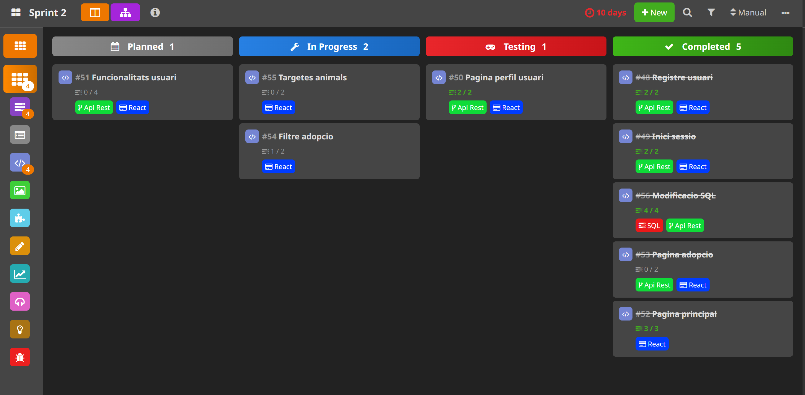
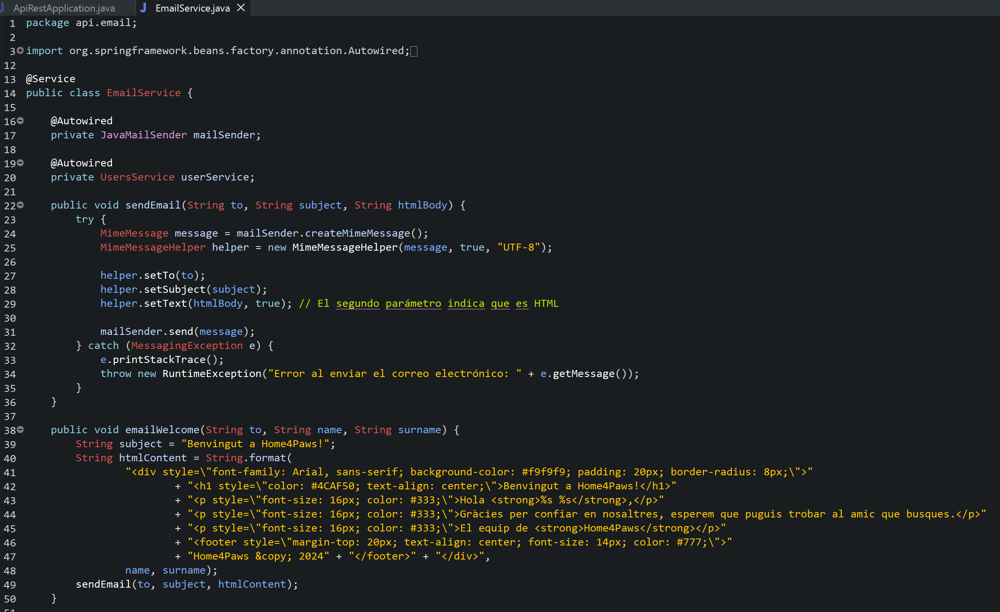

# Home4Paws - Projecte final Coding Bootcamp Fundación Esplai

Aquest projecte és el resultat de tot l'aprenentatge i dels esforços dels membres del equip durant bootcamp. El nostre objectiu pel projecte és desenvolupar una pàgina web per asistir en l'adopció de diferents d'animals de companyia i ajudar als cuidadors d'aquests animals a trobar noves famílies pels nostres amics.

## Taula de continguts

- [Home4Paws - Projecte final Coding Bootcamp Fundación Esplai](#home4paws---projecte-final-coding-bootcamp-fundación-esplai)
  - [Taula de continguts](#taula-de-continguts)
  - [1.- Informació](#1--informació)
    - [1.1.- Objectius del projecte](#11--objectius-del-projecte)
    - [1.2.- Funcionalitats principals](#12--funcionalitats-principals)
  - [2.- Tecnologies utilitzades](#2--tecnologies-utilitzades)
    - [2.1.- Backend](#21--backend)
    - [2.2.- Frontend](#22--frontend)
    - [2.3.- Metodologia i eines](#23--metodologia-i-eines)
  - [3.- Nous conceptes](#3--nous-conceptes)
  - [4.- Noves funcionalitats](#4--noves-funcionalitats)
  - [5.- Autors](#5--autors)
  - [6.- Agraiments](#6--agraiments)

## 1.- Informació

### 1.1.- Objectius del projecte

El principal objectiu d'aquest projecte és consolidar els coneixements adquirits durant el Bootcamp, 
la creació d'una api amb SpringBoot, conectar la api a la nostre base de dades, i tenir un frontend 
que pugui fer crides a través de la api.

A més des de la Fundació Esplai, els organitzadors del curs, ens demanen que aquest projecte estigui 
en sintonia amb algun dels Objectius de Desenvolupament Sostenible (ODS) de l'agenda 1530. 
En el nostre cas hem optat per alinear-nos amb les ODS 3 i 15, Salut i Benestar, i Vide de 
ecosistemes terrestres, respectivament.

La idea principal del projecte és treballar per millorar el benestar dels nostres amics d'altres 
especies, els animals de companyia, que en els ultims anys han passat de ser més que un animal de 
pastura o un animal que ajuda amb el control de plages, l'evolució de la societat a portat nous 
rols als nostres amics que a dia d'avui ja son membres integrats i funcionals dels nuclis familiar 
i per tant arribem a pensar com ells com els nostres fills.

### 1.2.- Funcionalitats principals

La nostra pàgina web, Home4Paws, disposa de varies funcionalitats per al ús del usuari.

La funció més important ja la tenim disponible a la pàgina d'inici, que seria poder buscar un animal 
des del cercador, aquest cercador et mostra tots els animals registrats, informació bàsica de cada 
animal i té a disposició del usuari una sèries de filtres per facilitar aquesta cerca.

Evidentment per poder adoptar un animal, hem de tenir animals registrats en la nostra base de dades, 
per això els usuaris ja registrats poden posar en adopció a aquells animals que no puguin mantenir 
per diverses raons.

També hem implementat un sistema de donatius entre usuaris, l'objectiu darrere aquesta funció és 
facilitar la colaboració d'usuaris que no poden tenir animals a casa però que volen ajudar a aquells 
que si que en tenen, sobre tot perque contemplem la posibilitat que un usuari sigui una protectora 
que aprofiti la nostra web per aumentar les posibilitats d'adopció.

Per acabar, tenim un sistema de micromesenatge per ajudar als usuaris a recollir diners per afrontar 
grans despeses com operacions o tractaments mèdics.

## 2.- Tecnologies utilitzades

Durant el projecte hem fet servir varies tecnologies treballades durant el curs, pel Backend em 
fet servir Springboot i SQL. i Pel Frontend hem fet servir react amb Typescript i el gestor de 
projectes Vite.

### 2.1.- Backend

Per entrar en detalls del Backend, primer tenim [SQL](https://dev.mysql.com/doc/) el qual hem treballat amb MySQL Workbench, tenim diferents taules separades per funcionalitats: pels animals, donacions, usuaris, peticions i micromesenatge. Les taules estan totes relacionades per la ID del usuari asignada en el moment del registre.

Pel que fa a [Springboot](https://spring.io/projects/spring-boot), tenim un projecte bàsic amb les dependències necessaries per traballar amb Spring, JPA, SQL i la gestió de correus electrònics. La base de la API es un CRUD per a cada una de les taules mencionades anteriorment, des d'aquí hem afegit noves parts per donar suport a les funcionalitats de la nostra pàgina, com el inici de sessió, buscar correus electrònics a la base de dades per verificar el registre o diferenciar les donacions entre donadors i receptor de la donació.

Hem organitzat la API en carpetes seguin la estructura de les taules  de la base de dades, per així tenir en la mateixa carpeta totes les capes de la API corresponents a cada element.


### 2.2.- Frontend

Pel que fa al Frontend hem creat un projecte de [React amb Vite](https://es.vite.dev/guide/) per agilitzar el procés de creació, per poder reutilitzar diferents components com botons i targetes amb informació. Durant el procés de desenvolupament hem treballat amb [TypeScript](https://www.typescriptlang.org/) per mantenir una bona qualitat del codi amb el fort tipat que ens aporta. I pel que fa al estil de la pàgina ens hem decantat per utilitzar [TailWindCSS](https://tailwindcss.com/)
que ens aporta un diseny distes i informal que s'ajusta al estil que voliem per la nostra pàgina.

### 2.3.- Metodologia i eines

En els primers dies del projecte vam optar per fer servir la metodologia Agile i vam invertir les primeres hores en fer una pluja de ideas i funcions que voliem implementar en la nostra pàgina. Tot això ens va permetre poder organitzar la feina a fer en diferents sprint i repartir-la bé entre els membres de l'equip, amb tot això clar, vam crear un projecte a [HacknPlan](https://hacknplan.com/) on vam plasmar els sprints previstos i crear les tasques que s'havien de fer.

També hem treballat amb [Git](https://git-scm.com/) i [GitHub](https://github.com/) on en base a una branca main els membres del equip separen les seves propies branques per treballar en les tasques evitant la creació de conflictes. Al final de cada sprint teniem programat combinar les branques per tal de posar en comú els avenços i comprobar que es complient els objectius.

Un altre cosa que feiem al final de cada sprint era revisar el Backlog per valorar si era possible implementar alguna d'aquelles funcions extres que teniem en reserva sempre que no afectes negativament a la producció prevista per aquells sprint.



## 3.- Nous conceptes

Després de parlar-ho entre els membres de l'equip volem fer menció a varis fets a destacar. Pel que fa al frontend volem remarcar una funció de filtre per buscar animals en adopció que tant si utilitzes la barra de cerca o les etiquetes de cada targeta la cerca esta vinculada i les opcions triades es veuen en les dos opcions.

En el seguent codi podem veure el vincle entre els dos filtres
```tsx
const filteredAnimals = animals.filter(animal => {
    const matchesSearch = searchQuery === '' || animal.nombre.toLowerCase().includes(searchQuery.toLowerCase());
    const matchesFilters = Object.entries(filters).every(([key, value]) => {
      if (!value) return true;
      switch (key) {
        case 'provincia': return animal.lugar === value;
        case 'animal': return animal.tipo === value;
        case 'sexo': return animal.sexo === value;
        case 'edad': return animal.edad === value;
        case 'raza': return animal.raza === value;
        default: return true;
      }
    });
    return matchesSearch && matchesFilters;
  });
```


També volem comentar que després de algunes hores vam podem implementar un servei de missatgeria a través del correu electrònic del projecte per donar al abenvinguda al nous usuaris.

```java
package api.email;

import org.springframework.beans.factory.annotation.Autowired;
import org.springframework.web.bind.annotation.PostMapping;
import org.springframework.web.bind.annotation.RequestMapping;
import org.springframework.web.bind.annotation.RequestParam;
import org.springframework.web.bind.annotation.RestController;

@RestController
@RequestMapping("/api/email")
public class EmailController {

    @Autowired
    private EmailService emailService;
//	Base email for reference
    @PostMapping("/send")
    public String sendEmail(@RequestParam String to, @RequestParam String subject, @RequestParam String content) {
        emailService.sendSimpleMessage(to, subject, content);
        return "Email sent successfully";
    }    
}
```



## 4.- Noves funcionalitats

Al finalitzar el projecte, ens vam quedar amb alguna funcionalitat a la recàmara. Per començar voldriem ampliar el sistema de correus electrònics per avisar al usuaris de diferents sitaucion que es poden donar a la nostra pàgina, com serien en canvi de contrasenya o modificació de la informació del perfil, la susbscripcio a les nostres newsletters per estar al dia de les nostres novetats, o per deixar constància de donacions a altres usuarios i participacions a campanyes de micromesenatge.

També voldriem ampliar els animals i races que gestionem a la base de dades, a dia d'avui només treballem amb gossos, gats, conills i ocells, pero ens agradaria afegir a mida que els usuaris ens ho demanin la posibilitat d'ampliar el nostre ventall d'opcions.

A més, volem afegir diferents idiomes a disposició dels usuaris, seria ideal poder treballar amb anglès, francès, alemany i tots els idiomes oficials d'Espanya.

Igualment, voldriem afegir un xat intern perquè els usuaris puguin parlar entre ells per compartir informació rellevant dels animals a adoptar o poder simplement posar al dia al antic propietari de la nova vida de la mascota.

I per acabar hauriem de fer un sistema bancari efectiu en cas que volguesim impementar aquesta pàgina i obrir-n'he el servei als usuaris ja que actualment el nostre sistema de donacions i micromesenatge simplement generen la notificació, però no hi ha cap procés bancari real darrera.

## 5.- Autors

**Enric Besora**  
  **Rol:** Project Manager i Desenvolupador de frontend.  
  **Contribució:** Implementació de la majoria d'interfícies d'usuari amb React i Typescript, i principal organitzador de la carga de treball.  
  
  [LinkedIn](https://www.linkedin.com/in/enricmiquelbesoranavarro/)
  
  [Github](https://github.com/enricbesora)

**Iker Lahera**  
  **Rol:** Desenvolupador de frontend i base de dades.  
  **Contribució:** Implementacio d'algunes funcions de la pàgina i creació de tota la base de dades.  
  
  [LinkedIn](https://www.linkedin.com/in/iker-lahera/)
  
  [Github](https://github.com/Ikerlahera)

**Bernat Ribas**  
  **Rol:** Desenvolupador de backend.  
  **Contribució:** Creació i modificacions de la API per assistir les diferents funcions de la pàgina i implementació d'alguna funció pels usuaris.  
  
  [LinkedIn](https://www.linkedin.com/in/bernatribasromeu/)
  
  [Github](https://github.com/BernatRibasRomeu)

## 6.- Agraiments

Volem expresar els nostres agraiments al Davide Bernal, profesor de les clases tècniques del Bootcamp, a la Teresa Cifuentes, profesora de les clases transversals(Softskills i treball en grup) i a la Betsabet Ranís tutora i cordinadora del nostre grup.

**David Bernal**

[LinkedIn](https://www.linkedin.com/in/david-bernal-gonzalez/)

[Github](https://github.com/DavidBernalGonzalez)  
**Teresa Cifuentes**

[LinkedIn](https://www.linkedin.com/in/teresacifuentescoachingycomunicaci%C3%B3n/)  
**Betsabet Ranís**

[LinkedIn](https://www.linkedin.com/in/betsabetran%C3%ADsforcades/)

